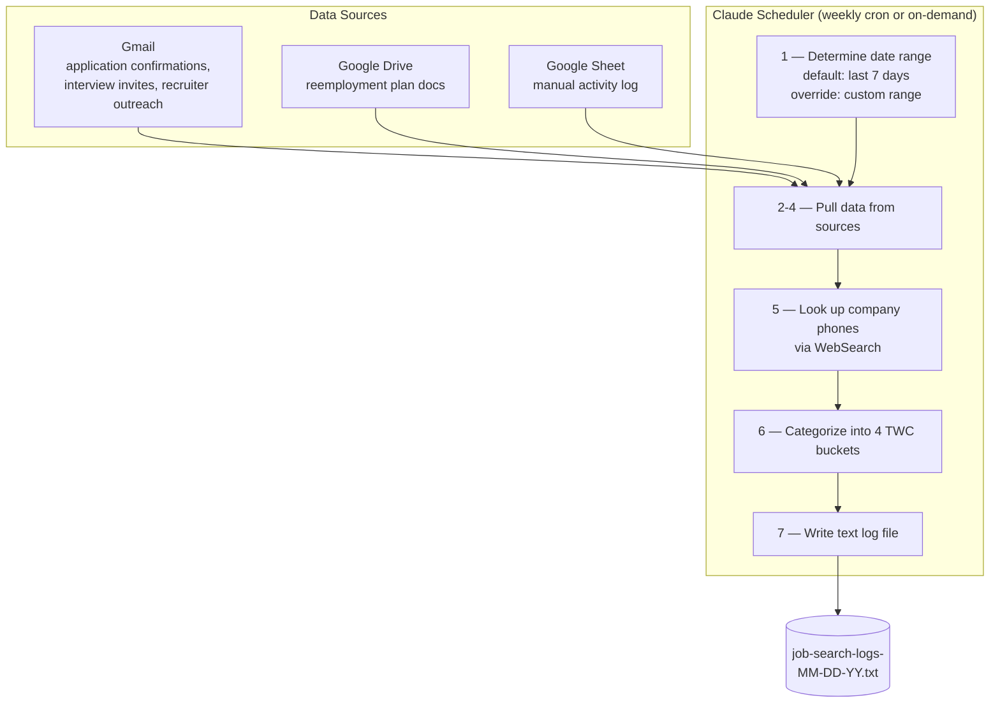

# Weekly Job Search Tracker — TWC Compliance Automation

An AI-powered scheduler that aggregates a week's worth of job search activity from Gmail, Google Drive, and a tracking spreadsheet into an audit-ready compliance log — built for unemployment benefit recipients in Texas who need to document their job search efforts under Texas Workforce Commission (TWC) rules.

Built on Claude with Cowork mode's scheduled task feature.

## Why this exists

The Texas Workforce Commission requires unemployment benefit recipients to document weekly job search activities and may audit them at any time. Manually compiling logs every week from email confirmations, Google Drive documents, and a personal tracking spreadsheet is tedious and error-prone. This scheduler does it automatically — every Tuesday morning, or on demand for any date range you specify.

## What it does

On a recurring schedule (or when manually triggered), the scheduler:

1. Pulls job application emails, interview invites, networking confirmations, and recruiter outreach from Gmail
2. Reads the latest manual entries from a Google Sheet of job search activities
3. Scans a designated Google Drive folder for newly added or modified reemployment plan documents
4. Looks up the public phone number for each company applied to (a TWC compliance requirement)
5. Categorizes everything into the 4 TWC-defined activity buckets
6. Outputs a clean, human-readable text log file ready for submission

## Architecture

## TWC's 4 job search activity categories

The output log is structured around the four categories TWC recognizes:

1. **Online & Database Registration** — WorkInTexas.com searches, LinkedIn/Indeed activity, employment agency registrations
2. **Direct Employer Contact** — applications submitted, interviews, follow-ups (each entry must include the company's public phone number)
3. **Networking & Professional Development** — job fairs, workshops, courses, informational interviews
4. **Reemployment Services** — reemployment plan updates, gap analyses, Workforce Solutions resources

## What's in this repo

| File | Purpose |
|------|---------|
| `SKILL.md` | The full prompt that drives the scheduler. Drop this into Claude Cowork mode as a scheduled task. |
| `README.md` | This file. |

## AI tools used

- **Claude** — the LLM driving orchestration and reasoning
- **Cowork mode + scheduled tasks** — for cron-style triggers
- **Gmail MCP** — pulls job-related emails by subject filter and date range
- **Google Drive MCP** — finds new and modified docs in a target folder
- **Claude in Chrome extension** — reads the Google Sheet (the Drive MCP doesn't expose Sheets contents directly)
- **WebSearch** — looks up company phone numbers for each application

## How to adapt for yourself

Edit `SKILL.md` and replace these placeholders with your own values:

| Placeholder | What to put there |
|-------------|-------------------|
| `<YOUR_NAME>` | Your legal name (the name TWC has on file) |
| `<YOUR_EMAIL>` | Your Gmail address |
| `<YOUR_DRIVE_FOLDER_ID>` | Google Drive folder where you keep job-search docs (find it in the folder's URL) |
| `<YOUR_DRIVE_FOLDER_NAME>` | The display name of that folder |
| `<YOUR_SHEET_ID>` | Google Sheet you use to manually log activities (find it in the sheet's URL) |

Then in Claude Cowork mode, create a scheduled task and paste the contents of `SKILL.md` as the prompt. Set the cron expression to whenever you want it to run — for example, `30 11 * * 2` runs every Tuesday at 11:38 AM local time.

## Usage

**Default automatic run** — covers the last 7 days ending today. No input needed.

**Manual run with a custom date range** — trigger the task and include a date range in your message. Examples:

- "Run the weekly summary for 4/15 to 4/21"
- "Generate the log for 2026-04-15 to 2026-04-21"

Both dates are inclusive. If you give just month/day, the current year is assumed. The output filename reflects the range used:

- `job-search-logs-MM-DD-YY.txt` for default 7-day runs
- `job-search-logs-MM-DD-YY-to-MM-DD-YY.txt` for custom ranges

## Disclaimer

This is built for personal use. No warranty. TWC compliance requirements may change — verify against the current TWC documentation before relying on this for an audit response.
